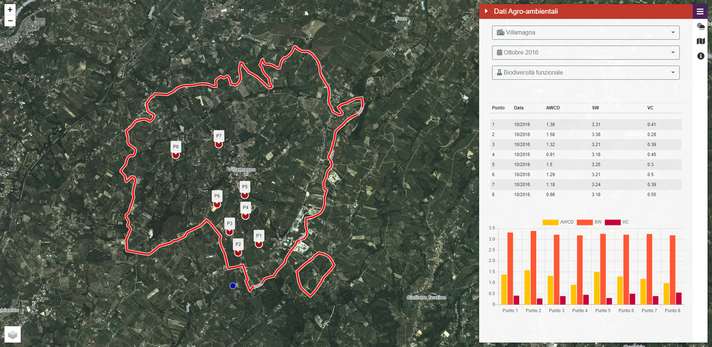

# UniAQ WebGIS
Applicazione client JavaScript per l'utilizzo dei servizi di consultazione e analisi dei dati agroambientali forniti da uniaq-geoapi. 
Consente l'accesso ai dati agroambientali, ai dati delle stazioni meteo nell'area di interesse e l'analisi di dataset raster.

La <a href="https://alessiodl.github.io/uniaq-webgis/dist/index.html"><strong>demo</strong></a> si appoggia ad una versione delle API modificata per poter essere ospitata su Python Anywhere. E' necessaria l'autenticazione.

